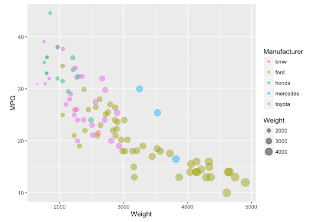
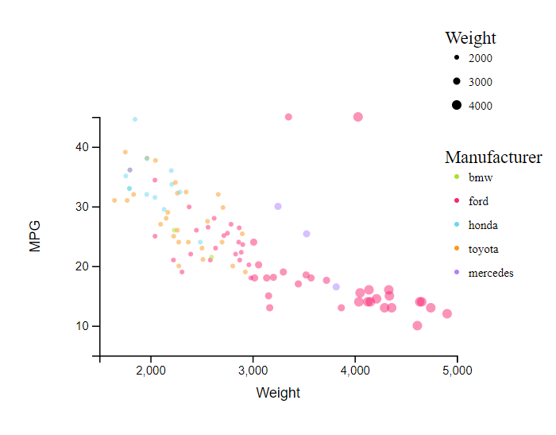
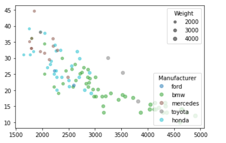
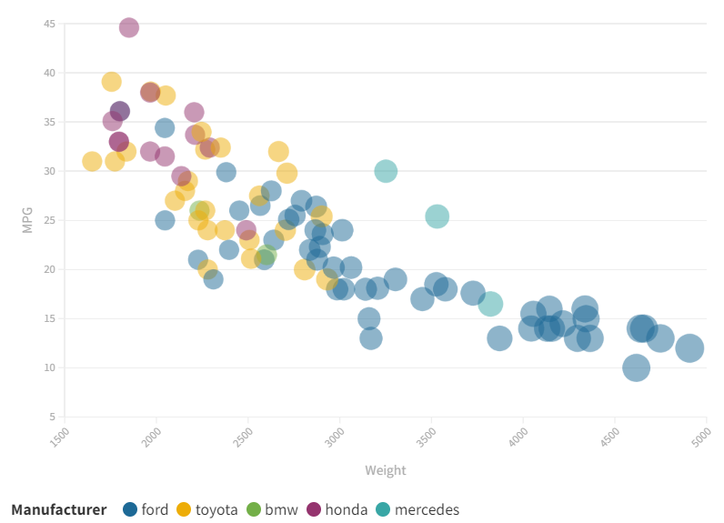
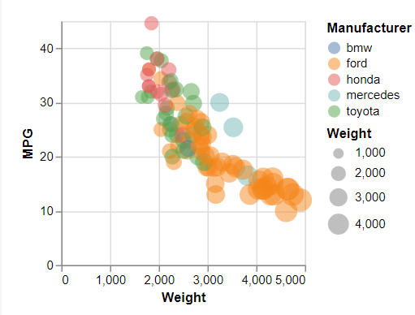

# 02-DataVis-5ways

# R + ggplot2 

I vizualized the dataset with ggplot2's `geom_point()` layer, with aesthetics functions for the color and size.
This was one of the easier applications to use because it took minimal coding and the legend was generatd automatically. 
There was also no additional formatting of the data needed in order to represent the manufacturer by color, and weight by size. 

# d3

I think that this is the visulaization that came out the best. I appended the plot to an svg to display the graph in a browser. I was able to control the colors relatively easliy, as well as format the size of the points with one function. 
One thing I struggle with in using d3 is understanding what attributes go where, but I suppose that comes with experience. 
I have never used d3 before this class, so learning how to do this was a bit of a curve. I primarily referred to these resources when creating my code: 
https://www.d3-graph-gallery.com/graph/scatter_basic.html
https://stackoverflow.com/questions/41848677/how-to-make-a-color-scale-in-d3-js-to-use-in-fill-attribute 

# matplotlib

I have experience using matplotlib before, so this is the first visualization I tried to make. Creating the graph was relatively easy, however, it took me a little bit to figure out the color mapping. I also was playing with the legend for a while before I just added the manufacturers manually, because the legend was displaying the color code rather than the the value the code was mapped from (which makes sense to me, I just gave up trying to fix it) 

# flourish

I had never heard of flourish before this assingment, however it was by far the easiest to use. The user interface was very easy to understand, and I was able to generate this visualization much faster than the other ones, although there was basically no coding involved. 

# vega-lite

I had never heard of vega either before this assignment. I used vega-lite, which was pretty straightforward to understand. However, the language is very sensitive to punctuation and formatting, which is annoying. I also could not figure out how to make the points a tad smaller so they were not so big on the graph. 

I used this source for this visualization:
https://vega.github.io/vega-lite/examples/point_2d.html

## Technical Achievements
- Included a legend in all charts which displayed the color mapping and size mapping for weight and manufacturer
